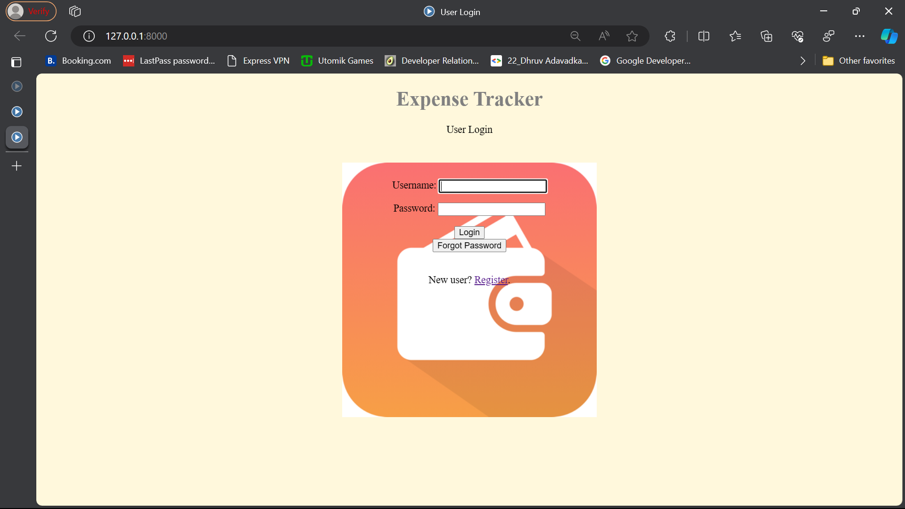
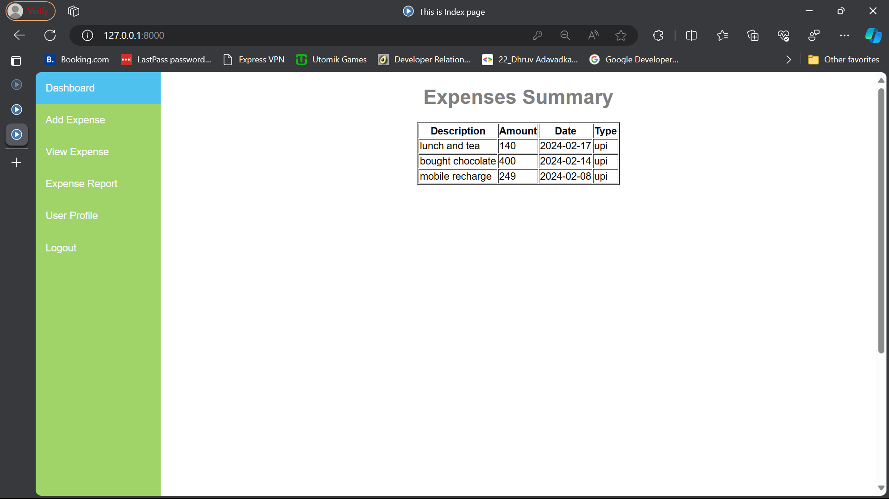
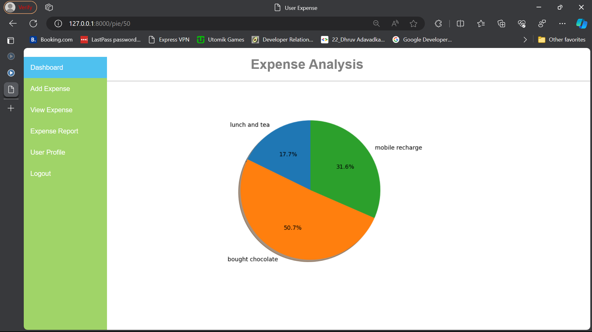

# Expense Tracker

## Overview

The Expense Tracker is a Django web application that helps users manage their expenses. Users can register, log in, create, edit, and delete expenses. The application also provides visualization of expenses through a pie chart.

## Features

- **User Authentication:** Allows users to register, log in, and log out.
- **Expense Management:** Create, edit, and delete expenses.
- **Expense Visualization:** View expenses in a pie chart for a visual representation.

## Screenshots

Include screenshots of the key features to provide a visual representation of your project.

1. **Login Page:**
   

2. **Expense Dashboard:**
   

3. **Pie Chart Visualization:**
   

## Prerequisites

- Python 3.x
- Django 4.0.1
- Matplotlib library

## Installation

1. **Clone the repository:**

   ```bash
   git clone https://github.com/your-username/expense-tracker.git

2. **Apply migrations:**

   ```bash
      python manage.py migrate

3. **Run the development server:**


   ```bash
      python manage.py runserver
   
3. **Open the application in your browser:**

http://localhost:8000/

## Configuration
### Matplotlib:
Ensure that the Matplotlib library is installed.

## Usage
Register or log in to your account.
Manage your expenses by creating, editing, or deleting records.
Visualize your expenses using the pie chart feature.

## Contributing
If you'd like to contribute to this project, please follow our Contribution Guidelines.

## License
This project is licensed under the MIT License.

## Acknowledgments
Special thanks to Django for the web framework.
Pie chart visualization powered by Matplotlib.
